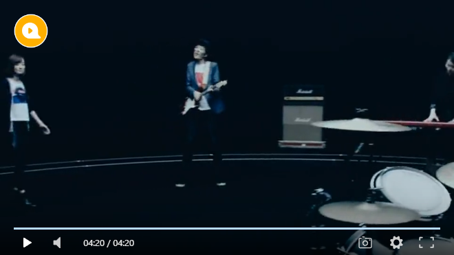

<h1 align="center">DPlayer-Lite</h1>

> 🍭 Wow, such a lovely HTML5 video playe
>
> 🍭 Forked from [DIYgod/DPlayer](https://github.com/DIYgod/DPlayer)
>
> 🍭 Remove thumbnails, subtitle, danmaku, storage
>
> 🍭 Add muted

## Introduction

DPlayer is a lovely HTML5 video player to help people build video easily.

**DPlayer supports:**

-   Streaming formats
    -   [HLS](https://github.com/video-dev/hls.js)
    -   [FLV](https://github.com/Bilibili/flv.js)
    -   [MPEG DASH](https://github.com/Dash-Industry-Forum/dash.js)
    -   [WebTorrent](https://github.com/webtorrent/webtorrent)
    -   Any other custom streaming formats
-   Media formats
    -   MP4 H.264
    -   WebM
    -   Ogg Theora Vorbis
-   Features
    -   Screenshot
    -   Hotkeys
    -   Quality switching

Using DPlayer on your project? [Let me know!](https://github.com/DIYgod/DPlayer/issues/31)

**[Docs](https://dplayer.diygod.dev/)**

**[中文文档](https://dplayer.diygod.dev/zh/)**

## Options

You can custom your player instance by those options

| Name                 | Default                            | Description                                                                                                                  |
| -------------------- | ---------------------------------- | ---------------------------------------------------------------------------------------------------------------------------- |
| container            | document.querySelector('.dplayer') | player container                                                                                                             |
| live                 | false                              | enable live mode, see [#live](#live)                                                                                         |
| autoplay             | false                              | video autoplay                                                                                                               |
| theme                | '#b7daff'                          | main color                                                                                                                   |
| loop                 | false                              | video loop                                                                                                                   |
| lang                 | navigator.language.toLowerCase()   | values: 'en', 'zh-cn', 'zh-tw'                                                                                               |
| screenshot           | false                              | enable screenshot, if true, video and video poster must enable Cross-Origin                                                  |
| airplay              | false                              | enable airplay in Safari                                                                                                     |
| chromecast           | false                              | enable Chromecast                                                                                                            |
| hotkey               | true                               | enable hotkey, support FF, FR, volume control, play & pause                                                                  |
| preload              | 'auto'                             | values: 'none', 'metadata', 'auto'                                                                                           |
| volume               | 0.7                                | default volume, notice that player will remember user setting, default volume will not work after user set volume themselves |
| playbackSpeed        | [0.5, 0.75, 1, 1.25, 1.5, 2]       | optional playback speed, or or you can set a custom one                                                                      |
| logo                 | -                                  | showing logo in the top left corner, you can adjust its size and position by CSS                                             |
| preventClickToggle   | false                              | prevent toggle video play/pause status when click player                                                                     |
| video                | -                                  | video info                                                                                                                   |
| video.quality        | -                                  | see [#Quality switching](#quality-switching)                                                                                 |
| video.defaultQuality | -                                  | see [#Quality switching](#quality-switching)                                                                                 |
| video.url            | -                                  | video url                                                                                                                    |
| video.pic            | -                                  | video poster                                                                                                                 |
| video.type           | 'auto'                             | values: 'auto', 'hls', 'flv', 'dash', 'webtorrent', 'normal' or other custom type, see [#MSE support](#mse-support)          |
| video.customType     | -                                  | custom video type, see [#MSE support](#mse-support)                                                                          |
| contextmenu          | []                                 | custom contextmenu                                                                                                           |
| highlight            | []                                 | custom time markers upon progress bar                                                                                        |
| mutex                | true                               | prevent to play multiple player at the same time, pause other players when this player start play                            |
| muted                | false                              | video muted                                                                                                                  |

## Thanks

### Sponsors

### Contributors

## Author

**DPlayer** © [DIYgod](https://github.com/DIYgod), Released under the [MIT](./LICENSE) License. 
Authored and maintained by DIYgod with help from contributors ([list](https://github.com/DIYgod/DPlayer/contributors)).

> [Blog](https://diygod.me) · GitHub [@DIYgod](https://github.com/DIYgod) · Twitter [@DIYgod](https://twitter.com/DIYgod) · Telegram Channel [@awesomeDIYgod](https://t.me/awesomeDIYgod)
